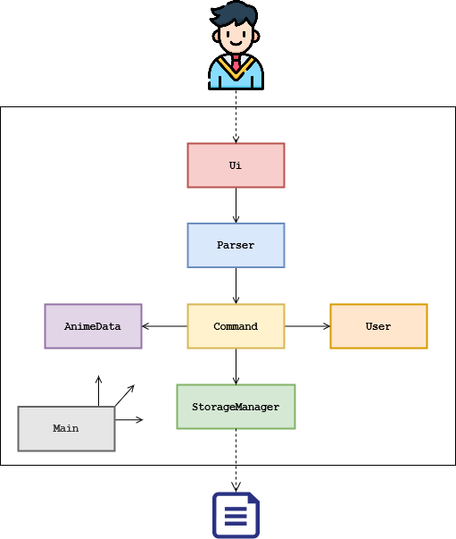
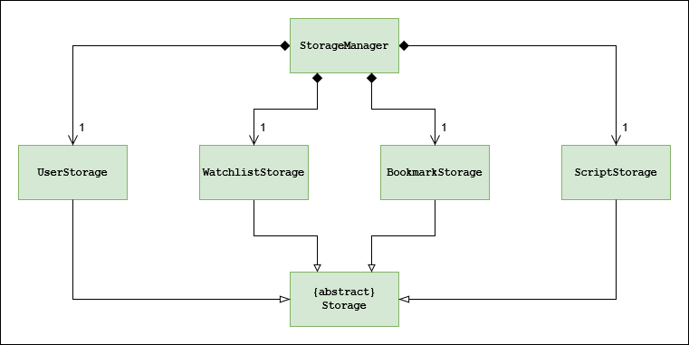
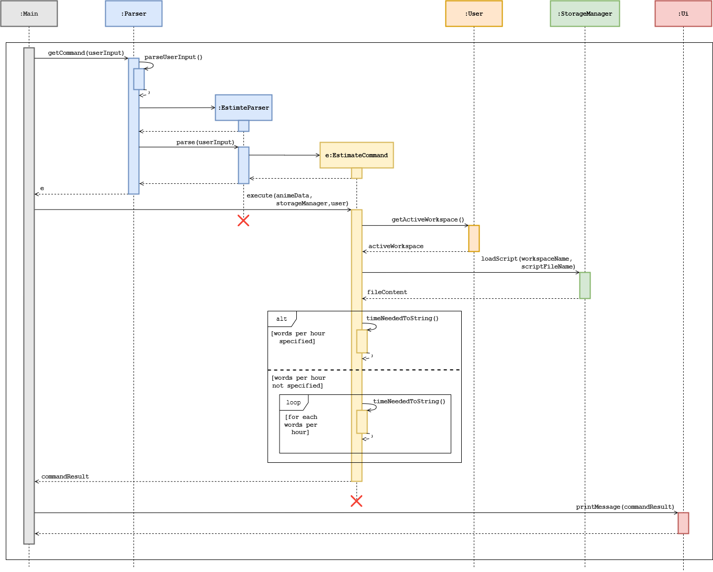

# Developer Guide

## Table of Content
1. [Introduction](#1-introduction)
 &nbsp;1.1 [Purpose](#11-purpose)
 &nbsp;1.2 [Using this Guide](#12-using-this-guide)
2. [Setting Up](#2-setting-up)
3. [Design](#3-design)
 &nbsp;3.1 [Architecture](#31-architecture)
 &nbsp;3.2 [UI Component](#32-ui-component)
 &nbsp;3.3 [Parser Component](#33-parser-component)
 &nbsp;3.4 [Command Component](#34-command-component)
 &nbsp;3.5 [AnimeData Component](#35-animedata-component)
 &nbsp;3.6 [User Component](#36-user-component)
 &nbsp;3.7 [Storage Component](#37-storage-component)
4. [Implementation](#4-implementation)
 &nbsp;4.1 [Workspace Feature](#41-workspace-feature)
 &nbsp;4.2 [Estimation Feature](#42-estimation-feature)
 &nbsp;4.3 [Bookmark Feature](#43-bookmark-feature)
 &nbsp;4.4 [Browse Feature](#44-browse-feature)
5. [Produce Scope](#5-product-scope)
 &nbsp;5.1 [Target User Profile]()
 &nbsp;5.2 [Value Proposition]()
6. [User Stories](#6-user-stories)
7. [Non-Functional Requirements](#7-non-functional-requirements)
8. [Documentation, logging, testing, configuration, dev-ops](#8-documentation-logging-testing-configuration-dev-ops)
9. [Glossary](#9-glossary)
10. [Appendices](#10-appendices)
 &nbsp;10.1 [Instructions for manual testing]()

## 1. Introduction
**AniChan** is a command-line application written in **Java 11**. It is written using the Object-Oriented Programming (OOP) paradigm which provides us with means to structure a software program into organized, reusable and reusable pieces of code that makes it good for future improvements and revisions.

### 1.1 Purpose

This content of this guide is aimed at current and new developers of AniChan. It contains the basic steps to set up a development environment, organize your source code, and then build and test AniChan. This guide also aids developers in understanding the overall architecture design and lays out the current implementation details of our notable features with the rationale and considerations behind each one.

### 1.2 Using this Guide
The content of this developer guide is aimed at both current and new developers who are keen on contributing to AniChan. The guide will contain the basic steps to using AniChan to set up a development environment, organize your source code, and then build and test your application. This developer guide is an essential tool that will introduce you to the various features and design concepts which you can use to further develop and maintain AniChan.
 
 

## 2. Setting Up
### Setting up the project in your computer

Ensure that you have the following installed: 
* JDK 11.
* IntelliJ IDE (highly recommended).

Firstly, **fork** this repo and **clone** a copy into your computer.

If you plan to use Intellij IDEA: 
1. **Ensure IntelliJ is configured to use JDK 11**.
    1. Click on `Configure` > `Structure for New Projects` > `Project Settings` > `Project`, 
       and ensure the `Project SDK` is using **JDK 11**.
2. **Import the project as a Gradle project**.
    1. Click on `Import Project` and locate the `build.gradle` file and select it. Click `OK`
    2. If asked, choose to `Open as Project` (not `Open as File`).
    3. Click `OK` to accept the default settings but do ensure that the selected version of `Gradle JVM` matches the JDK being used for the project.
    4. The import process could take a few minutes to finish.
3. **Verify the setup**: 
    1. Run the `seedu.anichan.Main` and try a few commands. 
    2. You may want to refer to our [User Guide](UserGuide.md) for the list of commands.

----

### Before writing code
1. **Configuring the coding style**

    If using IDEA, follow this guide 
    [IDEA: Configuring the code style](https://se-education.org/guides/tutorials/intellijCodeStyle.html) 
    to setup IDEA’s coding style to match ours.

2. **Set up CI**

    There is no set up required as the project comes with a GitHub Actions config files, 
    located in `.github/workflows` folder. When GitHub detects these files, it will run the CI for the project
    automatically at each push to the master branch or to any PR.

3. **Learn the design**

    When you are ready to start writing codes, 
    we recommended that you have a look at AniChan's overall design 
    by reading about it at [AniChan's architecture](DeveloperGuide.md#31-architecture).

 

## 3. Design 

The following section describes the architecture design of **Anichan**. This section starts off by looking at the overall architecture design in a general view, before going into the specific implementation details of the individual features.

### 3.1 Architecture
This section will help provide insight to the general overview of Anichan’s architecture.

 

*Figure 1: Architecture Diagram*

| :bulb:  | The images used are stored in the directory: `images/`. If you wish to update a diagram you may replace the images in this folder |
|---------------|:------------------------|

The **Architecture Diagram** presented above explains the high-level design of AniChan, and given below is a quick overview of each component involved.

The `Main` class is the starting point of the application and has only one class called `Main`, it is responsible for, 
* At launch: Initializes the various components in the correct sequence, connects them up with each other, and loads any saved data.
* At shut down: Shuts down the components and invokes any clean up methods where necessary.

The rest of AniChan consists of 6 components: 
- `Ui`: Manages the user interface of AniChan.
- `Parser`: Parses the user input.
- `Command`: Executes the command.
- `User`: Manages the workspace(s) and user data.
- `AnimeData`: Provides data from the anime source file.
- `StorageManager`: Reads data from, and writes data to, the hard disk.

 

Below is an overall sequence diagram to help illustrate the general program flow and how the different objects interact with each other.

 

  
*Figure 2: Overall Sequence Diagram* 
 
 

### 3.2 UI Component
  
*Figure 3: UI Component Diagram*

The UI component consists of a `UI` class that handles all user input and system output. The UI is only dependent on the `Main` class and does not interact directly with other classes ensuring high cohesiveness and separation of roles.

The `Ui` component listens for: 
*  the execution of commands to print the result of the Command.
* any exceptions thrown to show an error message to the user, instead of a program termination.

 

### 3.3 Parser Component
  
*Figure 4: Parser Component Diagram*

The `Parser` component consists of a `Parser` class and multiple `XYZParser` each representing a specific command’s parser. The Parser class will first receive a user command from `Main` and will proceed to determine the command type.

Once the command type is known, it will then create the respective `XYZParser` class.

Example: If Browse command was parsed, `Parser` will create `BrowseParser`.

`XYZParser` will then parse the parameter and perform input validation, before creating the Command object to return to `Main`.

 

### 3.4 Command Component
  
*Figure 5: Command Component Diagram*

The `Command` component consists of different commands represented together as `XYZCommand` which all inherits from the abstract `Command` class. 

Example: The Browse command would be represented by a `BrowseCommand`.

`Main` would utilise the `Command.execute` operation to carry out the execution of the command and retrieve a String output that will contain the successful result of the `Command`. If the `Command` was not successful an exception will be thrown with details of the failure.

 

### 3.5 AnimeData Component
  
*Figure 6: AnimeData Component Diagram*

The `AnimeData` component is responsible for retrieving offline json data and parsing it into `Anime` objects that will be stored in program memory. The `AnimeData` will manage an ArrayList of `Anime` objects providing AniChan with an interface for the program to retrieve with the source data.

The `AnimeData `component:
* can retrieve Anime objects using ID.
* can view detailed  information of each Anime Object.
* can browse the Anime catalog with sorting algorithms.

 

### 3.6 User Component
  
*Figure 7: User Component Diagram*

The User inherits from the abstract `Human` class and stores the name and gender of the user. It represents the user's interaction with `Workspace` class.

The `User`component: 
* can provide user information like `name`, `gender`, and `honorific name`
* Stores an array list of type `Workspace`
* can add, set, and switch between workspaces 

The `Workspace` component:  
* can allow `User` to create and get the list of `Watchlist` and `Bookmark`.
* can allow `User` to change his active `Watchlist`.

 

### 3.7 Storage Component
  
*Figure 8: Storage Component Diagram*

The `Storage` component consist of `StorageManager` which:
* can **save** workspace created by the user as a folder.
* can **save** user, watchlist and bookmark data in `.txt` format and **read it back** using 
their respective storage class, `UserStorage`, `WatchlistStorage`, and `BookmarkStorage`.
* can **read** script files that are in `.txt` format using the class `ScriptStorage`.

**AniChan** saved these data as `.txt` files so advanced users will be able to view and manipulate these saved data easily with any available text editor.

 

### 4.6 Estimation Feature

The `estimate` feature aims to provide translators with better estimates on the time needed to translate a script based on their capability. Hence, users will be able to ensure they do not overpromise their clients.

| :bulb:  | The application only accepts `.txt` files. |
|---------------|:------------------------|

 

#### 4.6.1 Current Implementation

The `estimate` feature is facilitated by `EstimateCommand`, which extends from the abstract class `Command`. In addition, it implements the following operation: 
* `EstimateCommand#timeNeededToString()`: Converts the time calculated into a `String` that displays the hour(s) and minute(s) needed.

`EstimateCommand` is instantiated by `EstimateParser`, and it requires one mandatory and one optional parameter, namely the `ScriptFileName` and `wordsPerHour`. If the optional parameter is not specified, the values 400, 500, and 600 words per hour (average translators’ speed) are used to generate 3 estimation timings.

 

Given below is an example usage scenario and how the `estimate` command behaves at each step.

**Step 1:** User inputs the command `estimate script.txt -wph 300`, the application calls `Parser#getCommand()` and passes the command to it.

**Step 2:** `Parser` extracts “estimate” from the command, and according to the command type, it calls `EstimateParser#parse()`.

**Step 3:** `EstimateParser` parses the command, extracts and validates the inputs “script.txt” and “300”. If no exception has been thrown, it creates and initialises `EstimateCommand` with “script.txt” and “300”, and returns it to `Parser`, which then returns it to `Main`.

**Step 4:** `EstimateParser` is terminated, and the application calls `EstimateCommand#execute()`.

**Step 5:** `EstimateCommand` calls `User#getActiveWorkspace` to initialise `activeWorkspace`. It then calls `StorageManager#loadScript()` to get the file content, and passes the workspace name (obtained by calling `getName()` on `activeWorkspace`) and `scriptFileName` to it.

**Step 6:** `EstimateCommand` calculates the estimated time using the file content and the `wordsPerHour` value specified, converts the value to a human readable format by calling `EstimateCommand#timeNeededToString()`, and return the command result for printing to the user.

**Step 7:** `EstimateCommand` is terminated.

 

*Figure x. Sequence diagram for estimating translation time needed for a script*

 

**4.6.2 Design Consideration**

This section shows some design considerations taken when implementing the estimate feature.

**Aspect: Reading of script file content**

**Alternative 1 (current design): During command execution**
* Pros: Easy to implement since `Command` already handle file matters.
* Cons: Waiting till command execution to validate the existence and validity of the script file would have wasted some memory resources.

**Alternative 2: During parsing**
* Pros: Ensures the command does not fail execution due to invalid file.
* Cons: Decreases cohesion as `Parser` now has to handle file matters on top of parsing matters, and this would affect the understandability, maintainability and reusability of the class. 

Having considered both of the alternatives, we have decided to implement the first alternative, that is to **read script file content during command execution** because we do not want to decrease the cohension of `Parser`, and we find that the memory resource that are wasted in the process is a worthy exchange for the cohesion preserved.

 

**Aspect: Script file name input**

**Alternative 1 (current design): User have to specify file extension**
* Pros: Ensures that the correct file will be read.
* Cons: Some users may not be aware of how to identify their file extension.

**Alternative 2: User do not have to specify file extension**
* Pros: Users can easily specify the file to read and do not have to worry about knowing the file extension.
* Cons: The application may end up reading the wrong file if there happens to be two files with the same file name but different file extension.

We have decided to the implement the first alternative, **users should specify the file extension in their input** because the importance of getting a correct estimation timing would outweighs and compensate for the hassle of entering the file extension. Moreover, we could end up losing potential users of the product as using the wrong estimation timing could be a costly mistake for these users.

 
